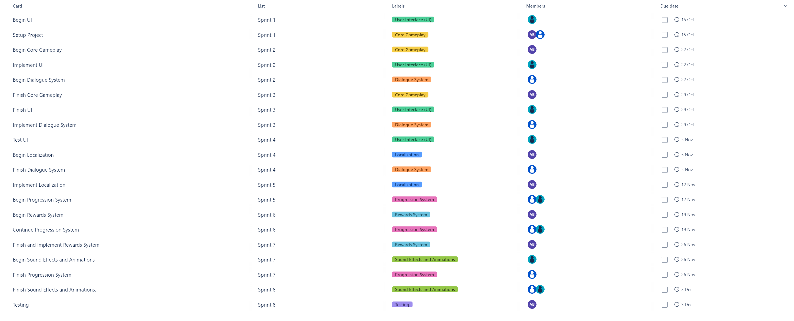
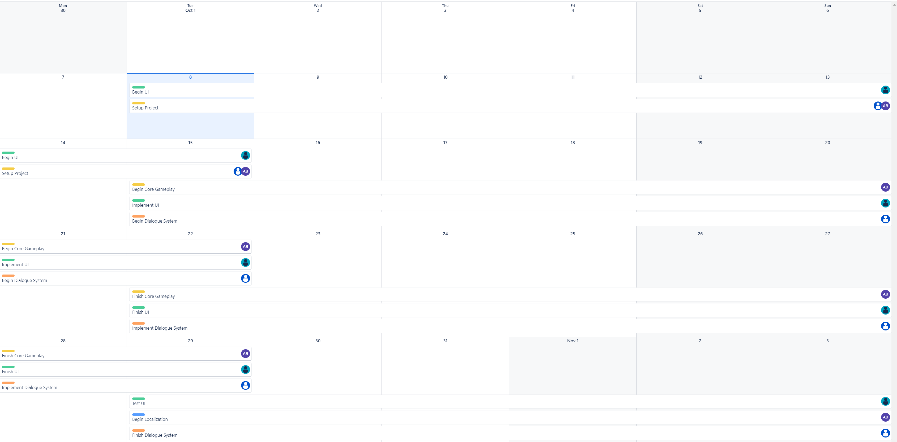
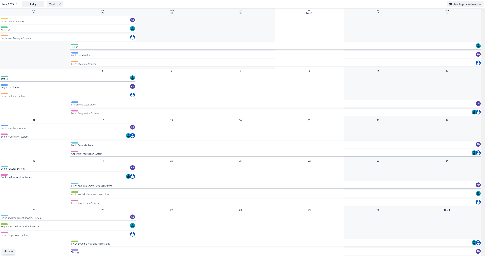
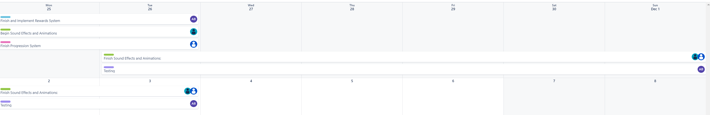

## Implementing Educational Maths Game Development

Advanced Games Programming 24/25

Aimar Goñi

2410569

## Research

### What sources or references have you identified as relevant to this task?

To effectively plan and execute the development of the educational maths game within the 8-week timeframe, I identified several key resources:

- **Agile Project Management and Scrum Methodology:** Understanding Agile principles and Scrum practices was essential for organizing the sprints, assigning tasks, and facilitating team collaboration.

- **Educational Game Design for Children:** Researching best practices in designing educational content for primary school students helped ensure the game would be both engaging and pedagogically sound.

- **Localization Techniques and Tools:** Since the game requires support for English, Spanish, and Korean, studying localization strategies was crucial for efficient implementation.

- **User Interface (UI) Design for Young Audiences:** Exploring UI/UX design principles tailored to children informed the development of intuitive and accessible interfaces.

I focused on authoritative sources such as official Scrum guides, academic journals on educational technology, and reputable design guidelines. These resources provided reliable and actionable insights that directly influenced our project's planning and execution.

#### Sources

- **"The Scrum Guide" by Ken Schwaber and Jeff Sutherland**  
  Authored by the creators of Scrum, this guide is the definitive resource on Scrum methodology.

  - **Aspects Analyzed:**
    - Sprint planning and timeboxing.
    - Role definitions and responsibilities within a Scrum team.
    - Backlog creation and prioritization.

  This guide influenced our decision to adopt Scrum practices for sprint planning and team collaboration. I appreciated its clarity and emphasis on iterative development and adaptability.

  *Reference:* Schwaber, K., & Sutherland, J. (2020). *The Scrum Guide*. Scrum.org.

- **"Designing Games for Children: Developmental, Usability, and Design Considerations for Making Games for Kids" by Carla Fisher**  
  Carla Fisher is an expert in children's interactive media.

  - **Aspects Analyzed:**
    - Cognitive and motor skills of primary school students.
    - UI/UX design principles suitable for children.
    - Engagement strategies for educational content.

  This resource guided the UI/UX design process and helped ensure that the game mechanics were appropriate for our target audience.

  *Reference:* Fisher, C. (2014). *Designing Games for Children*. Focal Press.

- **"Localization Essentials" by Microsoft Docs**  
  Microsoft's documentation provided best practices for software localization and internationalization.

  - **Aspects Analyzed:**
    - Structuring code for easy localization.
    - Managing language resources and cultural nuances.
    - Utilizing localization tools and workflows.

  The insights from this resource were instrumental in planning the localization process efficiently.

  *Reference:* Microsoft Docs. (n.d.). *Localization Essentials*. Retrieved from [Localization Essentials](https://docs.microsoft.com/en-us/globalization/localization/localization-essentials)

I avoided informal blogs or forums that might contain unverified information, as relying on such sources could introduce errors or inefficiencies into the project.

## Implementation

### What was the process of completing the task? What influenced your decision making?

**Project Planning and Sprint Breakdown:**

We initiated the project by defining the scope based on the client's key feature requirements. Using Trello, we created a board titled "Educational Maths Game Development" and organized it into eight lists representing each sprint.

**Sprint Planning:**

- **Sprint 1: Setup and UI Design**
  - *Tasks:*
    - Setup the project repository and development environment.
    - Begin UI design prototypes.
  - *Assigned to:*
    - Me (General Developer) and Developer 1 for project setup.
    - Developer 2 for UI design.

- **Sprints 2-3: Core Gameplay and Dialogue System**
  - *Tasks:*
    - Implement addition and subtraction exercises.
    - Design and implement the dialogue system.
    - Continue UI implementation.
  - *Assigned to:*
    - Me for core gameplay.
    - Developer 1 for dialogue system.
    - Developer 2 for UI implementation.

- **Sprints 4-5: Localization and Progression System**
  - *Tasks:*
    - Begin and implement localization for Spanish and Korean.
    - Design and start implementing the progression system.
  - *Assigned to:*
    - Me for Spanish localization and coordination with Korean translators.
    - Developer 1 and Developer 2 for progression system.

- **Sprints 6-7: Rewards System and Sound Effects/Animations**
  - *Tasks:*
    - Design and implement the rewards system.
    - Source and create sound effects and animations.
  - *Assigned to:*
    - Me for the rewards system.
    - Developer 2 for sound effects and animations.
    - Developer 1 to finalize progression system.

- **Sprint 8: Testing and Finalization**
  - *Tasks:*
    - Integrate all components.
    - Perform comprehensive testing.
    - Fix bugs and polish the game.
  - *Assigned to:*
    - All team members, with me focusing on overall testing.

**Influences on Decision Making:**

- **Team Expertise:** Assignments were based on each member's specialization to maximize efficiency.
- **Dependencies:** Tasks were scheduled to account for dependencies, such as needing the UI framework before implementing gameplay mechanics.
- **Client Priorities:** Core gameplay and educational value were prioritized to align with the client's objectives.

We regularly updated the Trello board with task statuses, comments, and due dates to maintain transparency and coordination.

### What creative or technical approaches did you use or try, and how did this contribute to the outcome?

**Use of Trello for Agile Project Management:**

- **Custom Labels and Checklists:** We used labels to categorize tasks (e.g., Core Gameplay, UI, Localization) and checklists within cards to break down tasks into subtasks.

- **Calendar Power-Up:** Enabled the calendar view to visualize deadlines and sprint timelines.


*Figure 1. Sprint overview calendar showing all assignments.*

**Localization Implementation:**

- **Resource Files:** We stored all text in resource files, one for each language.

  ```json
  // English.json
  {
    "welcome_message": "Welcome to Math Adventures!",
    "start_button": "Start"
  }

  // Spanish.json
  {
    "welcome_message": "¡Bienvenido a Aventuras Matemáticas!",
    "start_button": "Comenzar"
  }
  ```

  *Figure 2. Example of localization resource files for English and Spanish.*

**UI/UX Design for Children:**

- **Visual Aids:** Used colorful, large buttons with icons to make navigation intuitive.

- **Simplified Navigation:** Minimized the number of screens to prevent confusion.

### Did you have any technical difficulties? If so, what were they and did you manage to overcome them?

**Risk Mitigation:**

- **Buffer Time:** Included buffer periods in sprints to account for unforeseen delays.

- **Regular Stand-ups:** Held brief daily meetings to quickly identify and address issues.

## Outcome

**Deliverables:**

- **Sprint Plan Spreadsheet:**
  - [Download Sprint Plan Spreadsheet](ypIkBGP0 - educational-maths-game-development.csv)

- **Screenshots:**

  
  *Figure 2. Trello board overview showing all sprints and tasks.*

  
  *Figure 3. Detailed task list with assignments and due dates.*

  
  *Figure 4. Detailed task list with assignments and due dates.*

  
  *Figure 5. Detailed task list with assignments and due dates.*

**Achievements:**

- **Core Gameplay Implemented:** All four math operations with varying difficulty levels.

- **Progression and Rewards Systems:** Successfully tracks progress and rewards students with badges and points.

- **Dialogue System with Localization:** Provides instructions and feedback in English, Spanish, and Korean.

- **Child-Friendly UI:** Tested with primary school students for usability.

- **Engaging Audio-Visual Elements:** Added sound effects and animations to enhance engagement.

**Feedback:**

- **Positive Reception:** Early testers found the game enjoyable and educational.

- **Areas for Improvement:** Some users suggested additional game modes and customization options.

## Critical Reflection

### What did or did not work well and why?

**What Worked Well:**

- **Effective Use of Trello:** The visual organization of tasks and sprints in Trello kept the team aligned and the project on track.

- **Team Collaboration:** Clear communication and role definitions minimized misunderstandings and duplicated efforts.

- **Early Adoption of Localization Practices:** Planning for localization from the beginning streamlined the process and prevented significant rework.

**What Did Not Work Well:**

- **Underestimation of Task Complexity:** Some tasks, like the progression system, were more time-consuming than anticipated.

- **External Dependencies:** Relying on external translators introduced delays that affected the schedule.

- **Limited User Testing:** More extensive testing with the target demographic could have provided additional insights.

### What would you do differently next time?

- **More Detailed Task Estimation:** Break down tasks further during planning to better estimate time requirements.

- **Improve Communication with External Partners:** Establish clearer timelines and expectations with external translators.

- **Increase User Testing Phases:** Incorporate multiple rounds of user testing throughout development to iteratively improve the game.

- **Implement Continuous Integration:** Use automated testing and build processes to catch integration issues early.

## Bibliography

- Schwaber, K., & Sutherland, J. (2020). *The Scrum Guide*. Scrum.org.

- Fisher, C. (2014). *Designing Games for Children*. Focal Press.

- Microsoft Docs. (n.d.). *Localization Essentials*. Retrieved from [https://docs.microsoft.com/en-us/globalization/localization/localization-essentials](https://docs.microsoft.com/en-us/globalization/localization/localization-essentials)

## Declared Assets

- **Trello Board and Calendar Photos:** Created and managed by me, Aimar Goñi, and the development team.

- **AI Assistance:** This development journal was created with assistance from AI language model GPT-4.

